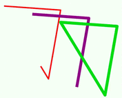
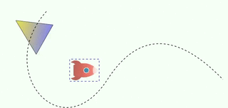
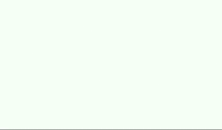
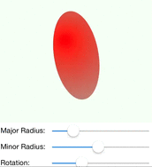
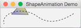
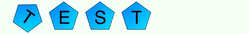
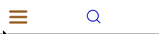

ShapeAnimation
==============

Vector animation framework in Obj-C based on CoreAnimation for iOS and OS X.
With it you can easily create various animations.

[![Build Status][travis-image]][travis-url]
[![BSD License][license-image]][license-url]

[travis-url]: https://travis-ci.org/rhcad/ShapeAnimation-ObjC
[travis-image]: http://img.shields.io/travis/rhcad/ShapeAnimation-ObjC/master.svg
[license-url]: LICENSE
[license-image]: http://img.shields.io/badge/license-BSD-blue.svg

## Features

 - Animation extension functions of CALayer and CAShapeLayer.
 - Group animations and cascaded animations using block function.
 - Support gradient fill with animation.
 - Custom animations with custom properties.
 - Helper functions to add image, text and vector shapes.
 - Convenience functions for CGPath, such as construction from SVG path and getting path length.
 - Layer hit-testing and dragging.

## Demos

There are two demo targets for [iOS](ShapeAnimation_iOSDemo) and [OS X](ShapeAnimation_OSXDemo) respectively
in the project. You can open the project with Xcode 6.0 or above.
The demo target for iOS has [basic animation examples][MasterVC] and [custom animation examples][EllipseVC].

[MasterVC]: ShapeAnimation_iOSDemo/MasterViewController.m
[EllipseVC]: ShapeAnimation_iOSDemo/EllipseViewController.m











### 1. Stroke lines example

```obj-c
CGPathRef path = CGPathFromSVGPath(@"M10,20L150,30 120,250Z");
CAShapeLayer *a = [view addShapeLayer:path position:CGPointMake(20, 10)];
[[CAAnimationGroup group:@[a.strokeEndAnimation, [a lineWidthAnimation:0 to:5]]]apply:^{
    [a.shakeAnimation apply];
}];
```

### 2. Move polygon with gradient fill along path

```obj-c
CGPathRef path = CGPathFromSVGPath(@"M120,70 C0,200 150,375 250,220 T500,220");
CAShapeLayer *la1 = [view addShapeLayer:CGPathFromSVGPath(@"M10,20L80,40 20,100Z")];
la1.gradient = [SAGradient gradient:@[(id)CGColorFromRGBA(0.5,0.5,0.9,1),
                                      (id)CGColorFromRGBA(0.9,0.9,0.3,1)]];

SAAnimationPair *a1 = [[la1 moveOnPathAnimation:path] setDuration:1.6];
SAAnimationPair *a2 = [la1.rotate360Degrees forever];
[[CAAnimationGroup group:@[a1, a2]].autoreverses.forever apply];
```

### 3. Draw ellipse with sliders

```obj-c
- (void)viewDidLoad {
    [super viewDidLoad];
    
    layer_ = [SAAnimationLayer layer:@[@"rx", @20, @"ry", @20]];
    layer_.drawBlock = ^(SAAnimationLayer *layer, CGContextRef ctx) {
        CGFloat rx = [layer getProperty:@"rx"], ry = [layer getProperty:@"ry"];
        CGRect rect = SARectWithCenter(layer.center, 2 * rx, 2 * ry);
        CGContextStrokeEllipseInRect(ctx, rect);
    };
    [self.shapeView addSublayer:layer_ frame:self.shapeView.bounds];
    
    [self radiusXChanged:self.rxSlider];
    [self radiusYChanged:self.rySlider];
}

- (IBAction)radiusXChanged:(UISlider *)sender {
    [layer_ setProperty:sender.value key:@"rx"];
}

- (IBAction)radiusYChanged:(UISlider *)sender {
    [layer_ setProperty:sender.value key:@"ry"];
}
```

### 4. Layer hit-testing and dragging

```obj-c
view.didTap = ^(SAShapeView *view, CGPoint point) {
    [view removeSelectionBorders];
    CALayer *layer = [view hitTestLayer:point];
    if (layer) {
        [[layer tapAnimation]apply:^{
            [view addSelectionBorder:layer];
        }];
    }
};
__block NSArray *selectedLayers = nil;
view.didPan = ^(SAShapeView *view, SAPanRecognizer *sender) {
    if (sender.state == SAGestureBegan) {
        selectedLayers = view.selectedLayers;
        [view removeSelectionBorders];
    }
    else if (sender.state == SAGestureChanged) {
        CGPoint translation = [sender translationInView:view];
        [sender setTranslation:CGPointZero inView:view];
        for (CALayer *layer in selectedLayers) {
            [CAAnimation suppressAnimation:^{
                layer.position = SAPointAdd(layer.position, translation);
            }];
        }
    }
    else if (sender.state == SAGestureEnded) {
        [view addSelectionBorders:selectedLayers];
        selectedLayers = nil;
    }
};
```

## License

ShapeAnimation is released under a BSD License. See [LICENSE file](LICENSE) for details.
